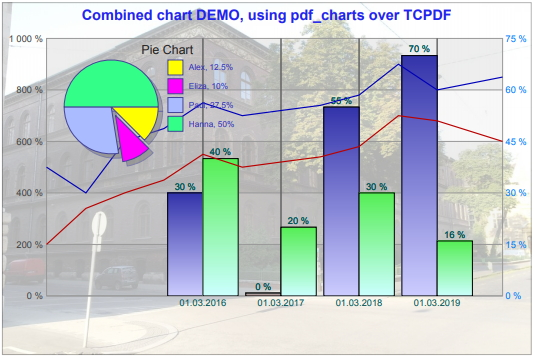

# pdfcharts: PHP class for drawing charts in PDF documents, created with TCPDF library



This class can render few basic charts in PDF documents with many configurable parameters.
Supported chart types:
* Line chart
* Bar chart
* Pie chart

Charts of different types can be combined inside one plot area.

## Installing
* In your code add a command `include_once("pdfcharts.php")`
* You will also need TCPDF library, so download it from repository and add to your project folder  or folder listed in PHP include_path.

## Using example
```php
include_once('tcpdf/tcpdf.pdf');
include_once('pdfcharts.pdf');
        
```

Upload modules and wiki is in progress...